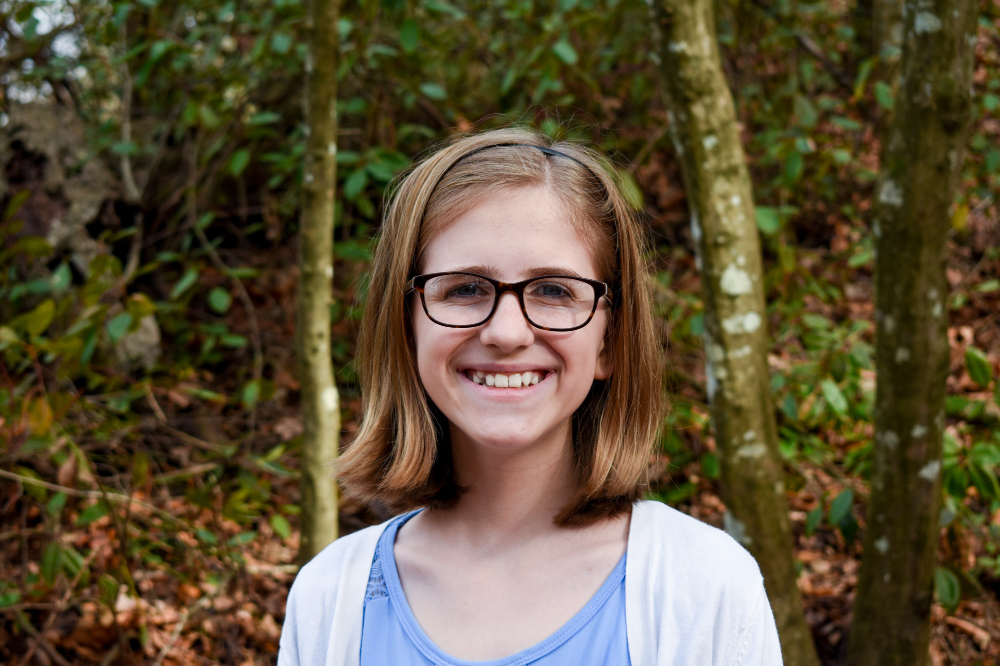
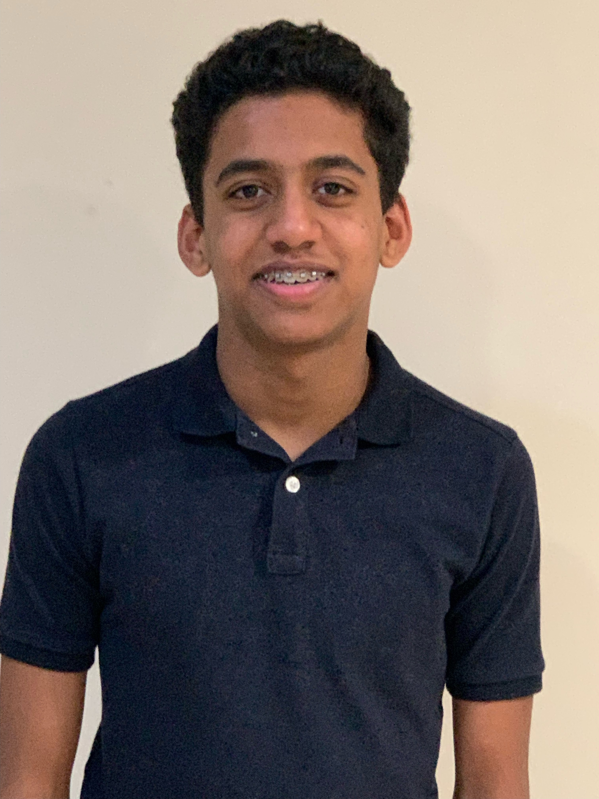
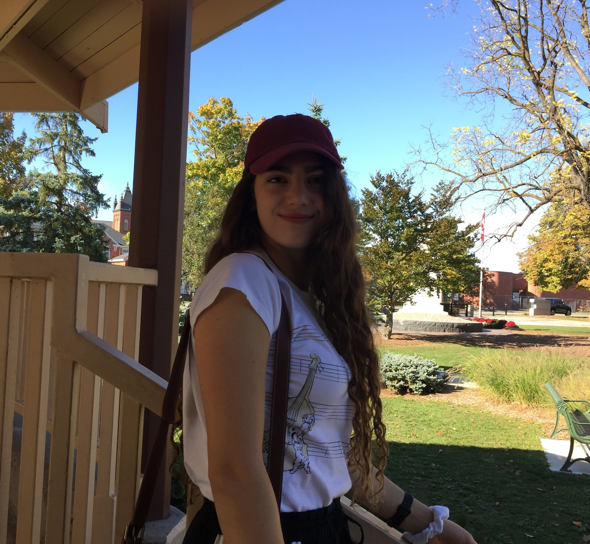
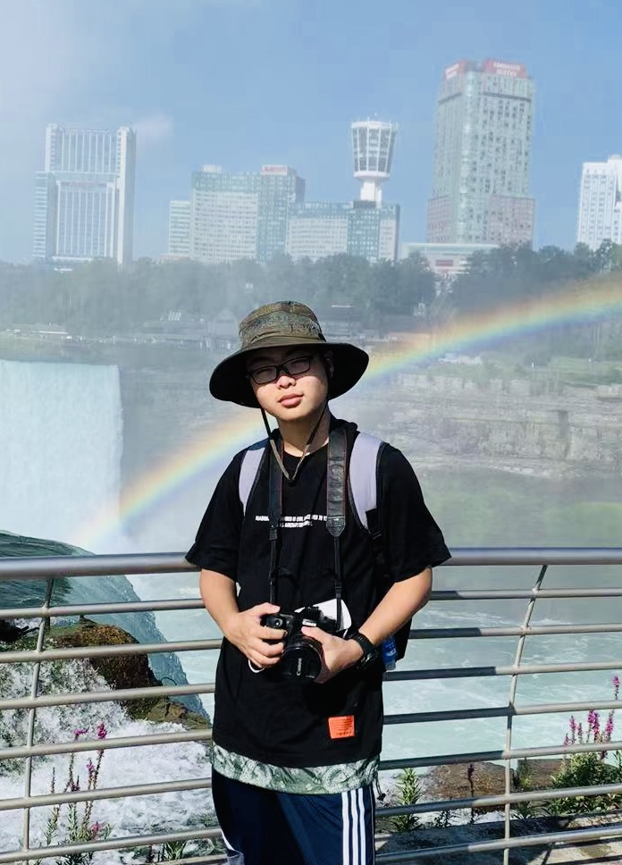
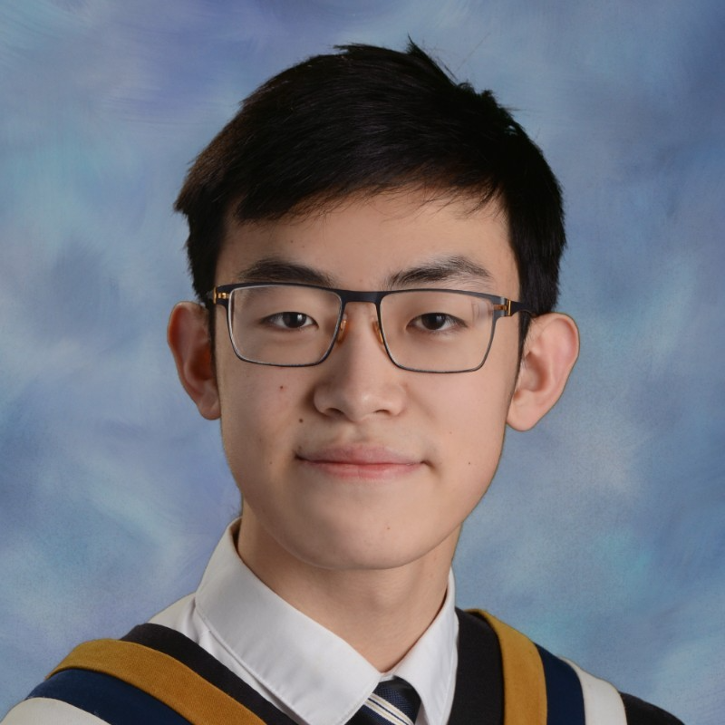
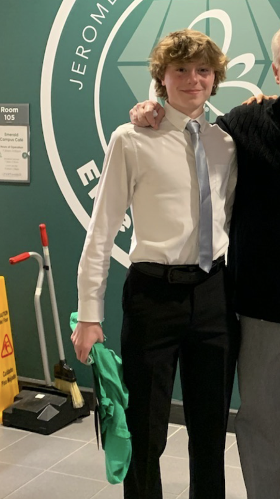

```{r setup, include=FALSE}
knitr::opts_chunk$set(echo = FALSE)
```


&nbsp;

## David Kane

```{r david, out.width ="50%"}
knitr::include_graphics("images/david_kane.png")
```

[David Kane](https://www.davidkane.info) is the former Preceptor in Statistical Methods and Mathematics in the Department of Government at Harvard University. 

&nbsp;

## Miriam Heiss

```{r miriam, out.width = "50%"}

```

[Miriam Heiss](https://github.com/miriamheiss) is a 8th grader (homeschooled), organist of 5 years, and amateur Data Scientist. 

&nbsp;

## Tejas Mundhe

<!-- There is something weird, I think, about this photo. It always shows up when I build it locally. But, once pushed to the web, it is fine. -->


```{r tejas, out.width ="50%"}

```

[Tejas Mundhe](https://github.com/TejasMundhe) is an incoming Sophomore at Walnut Hills High School with a passion for Data Science.

&nbsp;


## Stephanie Saab

```{r saab, out.width ="50%"}

```

[Stephanie Saab](https://github.com/AM-lmn) is a second year student at the University of Toronto.

&nbsp;


## Yuhan Wu

```{r yuhan, out.width ="50%"}

```

[Yuhan Wu](https://github.com/UhanWu) is an incoming junior at Newton North High School who is interested in Data Science and Applied Mathematics.

&nbsp;

## Arghayan Jeiyasarangkan

```{r arghayan, out.width ="50%"}
knitr::include_graphics("images/arghayan.png")
```

Arghayan Jeiyasarangkan is an upcoming sophomore at the University Of Ottawa studying biomedical science in French Immersion.

&nbsp;

## Felix Cai

```{r cai, out.width ="50%"}

```

Felix Cai is an upcoming second year Medical Sciences student at Western University.

&nbsp;

## Jackson Roe

```{r roe, out.width ="50%"}

```

Jackson Roe is a rising senior at Dublin Coffman High School.

&nbsp;


