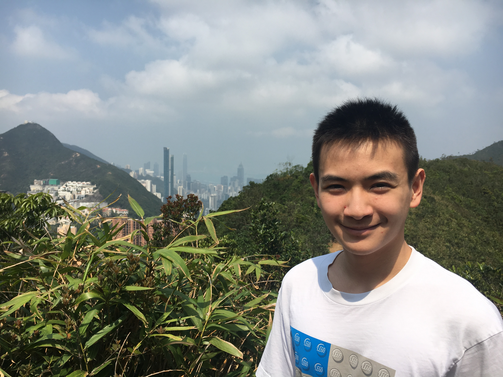
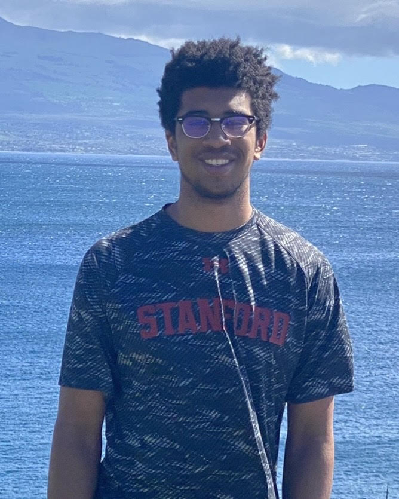

```{r setup, include=FALSE}
knitr::opts_chunk$set(echo = FALSE)
```


&nbsp;

## David Kane

```{r david, out.width ="50%"}
knitr::include_graphics("images/david_kane.png")
```

[David Kane](https://www.davidkane.info) is the former Preceptor in Statistical Methods and Mathematics in the Department of Government at Harvard University. 

&nbsp;


## Nuo Wen Lei

```{r nuowen, out.width ="50%"}

```

[Nuo Wen Lei](https://github.com/NuoWenLei) is a graduating senior from Concord Academy.

&nbsp;

## Tejas Mundhe

<!-- There is something weird, I think, about this photo. It always shows up when I build it locally. But, once pushed to the web, it is fine. -->


```{r tejas, out.width ="50%"}
knitr::include_graphics("images/tejas.jpeg")
```

[Tejas Mundhe](https://github.com/TejasMundhe) is an incoming Sophomore at Walnut Hills High School with a passion for Data Science.

&nbsp;


## Ryan Southward


```{r ryan, out.width ="50%"}

```

Ryan Southward is an incoming freshman at Stanford University likely studying Computer Science.

&nbsp;


## Yuhan Wu

```{r yuhan, out.width ="50%"}
knitr::include_graphics("images/yuhan.jpg")
```

[Yuhan Wu](https://github.com/UhanWu) is an upcoming junior at Newton North High School.

&nbsp;


